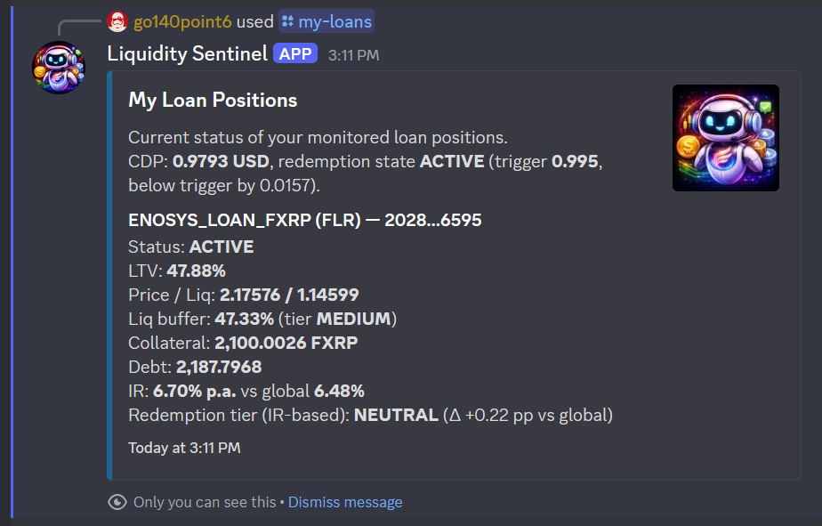
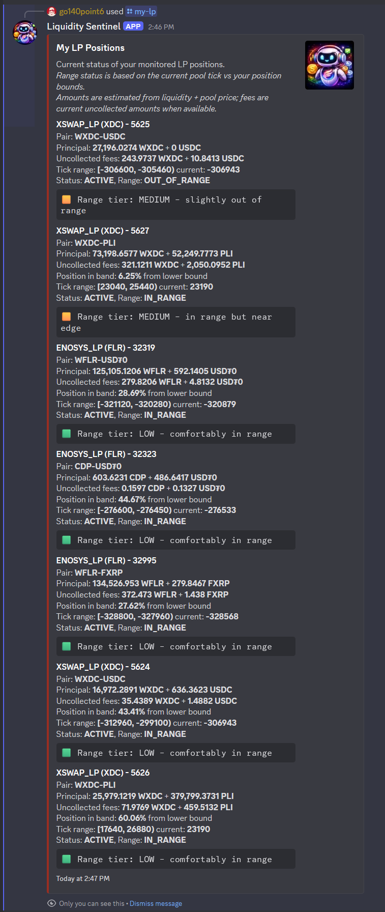
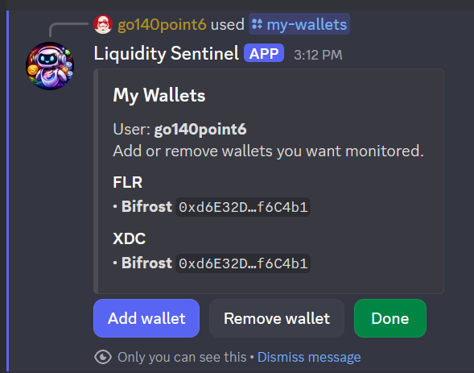
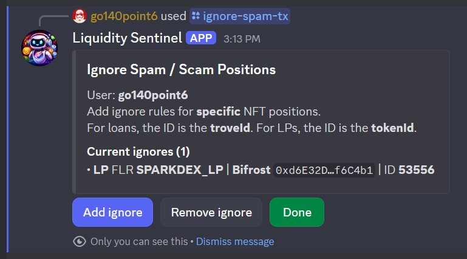
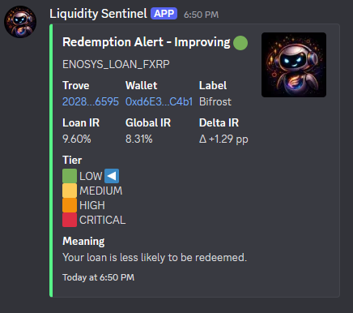
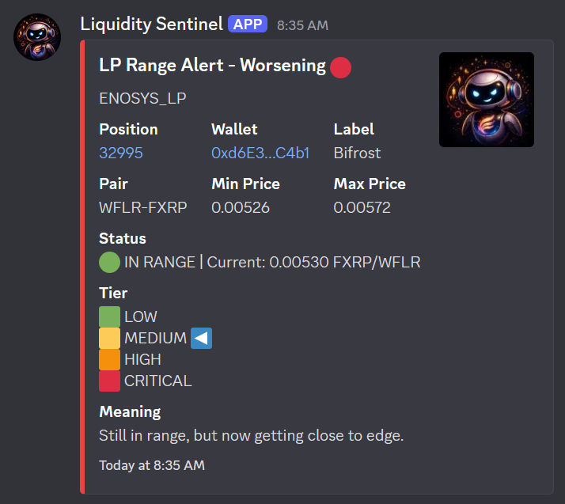
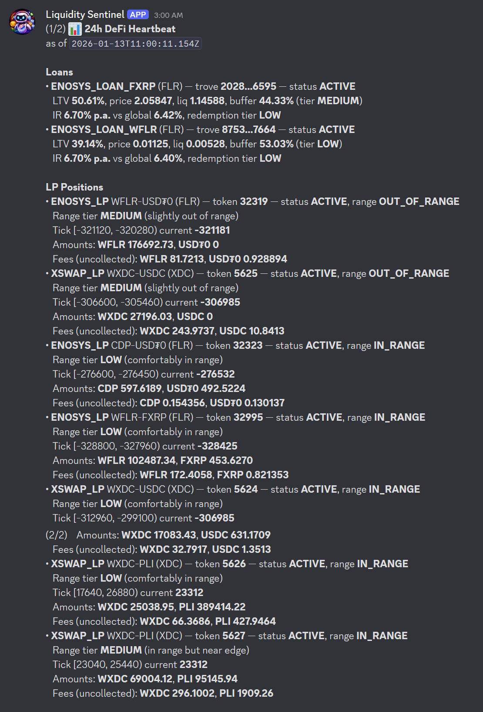

# Liquidity Sentinel

Liquidity Sentinel is a Discord bot that tracks DeFi positions (loans/troves and Uniswap v3 LPs), evaluates risk, and delivers actionable alerts and daily summaries.

Key focus:
- fast, readable position snapshots
- risk-tiered alerts that stay out of your way
- daily summaries to keep you oriented

---

## Features at a glance

### /my-loans
Loan/trove health, liquidation buffers, and redemption risk across supported chains with clear tiered status.

### /my-lp
Uniswap v3 LP positions with range status, estimated amounts from liquidity, and fee/position context.

### /my-wallets
Tracked wallets and linked positions, built for a quick coverage check. Includes an LP alert flag to suppress tier-only updates so you only get in-range/out-of-range changes when preferred.

### /redemption-rate
Target interest rates for redemption risk tiers with live guidance on where your loan would land.

### /ignore-spam-tx
Ignore noisy or irrelevant on-chain transactions to keep alerts focused on what matters.

---

## Monitoring & alerts

### Alert engine
Stateful alerting for liquidation/redemption thresholds and position risk changes with deduped notifications and tiered severity.

### Daily heartbeat DM
A daily summary DM with tracked positions, current status, and key liquidity/health signals.

---

## Other highlights

- Scheduled scanning so positions stay fresh in near-realtime.
- Multi-chain RPC support with strict environment validation.
- Lightweight custom logger for consistent, controllable output.

---

## License

MIT
